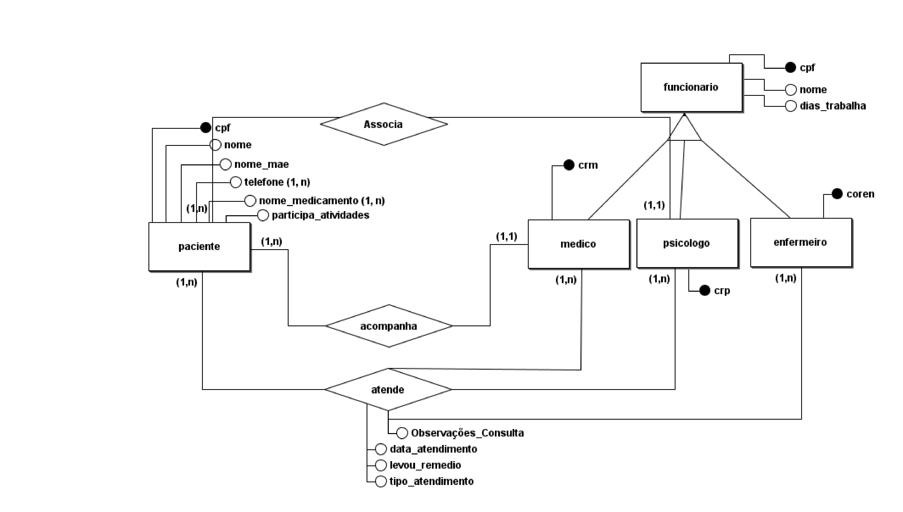

# Sistema de cadastro feito para o CAPS Nise da Silveira - Arapiraca

## 📖 Descrição

Esse projeto foi desenvolvido em equipe e se refere a um MVP de um sistema de cadastro de médicos, funcionários, psicólogos, enfermeiros e pacientes feito com base no funcionamento do CAPS Nise da Silveira de Arapiraca. A sigla CAPS faz referência a Centro de Atendimento Psicossocial, um local onde pessoas com transtornos mentais são consultadas por psiquiatras, enfermeiros e psicólogos. O conhecimento das regras do negócio veio a partir do meu período trabalhando no estabelecimento. 

## 🛠️ Funcionalidades

- Operações básicas de banco de dados (CRUD) para manipulação dos dados de médicos, funcionários, pacientes, enfermeiros e psicólogos.

## 📡 Tecnologias utilizadas

 

  

  

## ⏳ Inicialização

Esse projeto foi desenvolvido utilizando a linguagem de programação [Java](https://www.java.com/pt-BR/) com integração com um banco de dados [MySQL](https://www.mysql.com/). O design pattern [DAO](https://www.digitalocean.com/community/tutorials/dao-design-pattern) foi implementado no projeto, contudo não foi utilizada uma interface para delimitação das funções de acesso ao banco. O modelo ER (Entidade Relacionamento) do projeto pode ser visto abaixo:

 

 

## 🤵🤵‍♀️ Colaboradores

Os colaboradores desse projeto são eu (Eduardo Vítor), [Carlos André](https://github.com/oicarlos) e [Jânio Gameleira](https://github.com/GameleiraMonster).

 

## 🔎 Status do Projeto

 

## 📑 Referências

[Java](https://www.java.com/pt-BR/)

[MySQL](https://www.mysql.com/)

[DAO](https://www.digitalocean.com/community/tutorials/dao-design-pattern)